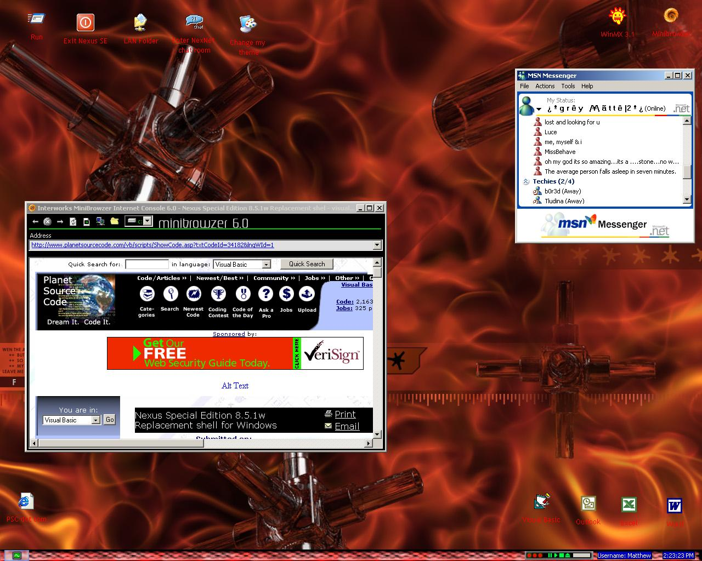



## Nexus Special Edition 8\.5\.1w Replacement shell for Windows

### Description

Nexus Special Edition is a replacement \ companion shell for MS Windows. It has many features, over 4MB worth of pure source code and commented generously.. Multiple user enabled, User rights policy system, Icon Transition FX, Skinnable theme components, RSA Encryption, Lock desktop icons with password, lock computer, built in Snake game, Shortcut menus, etc etc... The .zip file contains System files, Compiled installation (required for media and folder structure) and the source code. If you have any trouble getting the code to work, e-mail me and I'll try to help you as best as I can :). May even put a FAQ section up on my website. More screenshots available at http:\\www.angelfire.com\d20\vbfiles\files\nexus\nexus_scr\index.html. Find out about my new shell im developing at http:\\www.angelfire.com\d20\vbfiles\vb.html. Please feel free to e-mail me any suggestions about Nexus\EZShell [in development]. Enjoy! PS: You will need WinRAR from winrar.com to extract the source code element. (WinRAR is higher compression) 6MB download includes all required components. Background taken from www.skinz.org. Module PROBas.bas by unknown author [refers to non-working fusionz.net]. I have a new shell in the works at the moment that will supersede Nexus [view website 4 details]. Mail me if you have any questions. Hope you like the code guys!
 
### More Info
 

             |
---                |---
**Submitted On**   |2002-04-24 23:23:06
**By**             |[ByteForce UK](https://github.com/Planet-Source-Code/PSCIndex/blob/master/ByAuthor/byteforce-uk.md)
**Level**          |Advanced
**User Rating**    |4.6 (46 globes from 10 users)
**Compatibility**  |VB 5\.0, VB 6\.0
**Category**       |[Complete Applications](https://github.com/Planet-Source-Code/PSCIndex/blob/master/ByCategory/complete-applications__1-27.md)
**World**          |[Visual Basic](https://github.com/Planet-Source-Code/PSCIndex/blob/master/ByWorld/visual-basic.md)
**Archive File**   |[Nexus\_Spec766034272002\.zip](https://github.com/Planet-Source-Code/byteforce-uk-nexus-special-edition-8-5-1w-replacement-shell-for-windows__1-34182/archive/master.zip)

